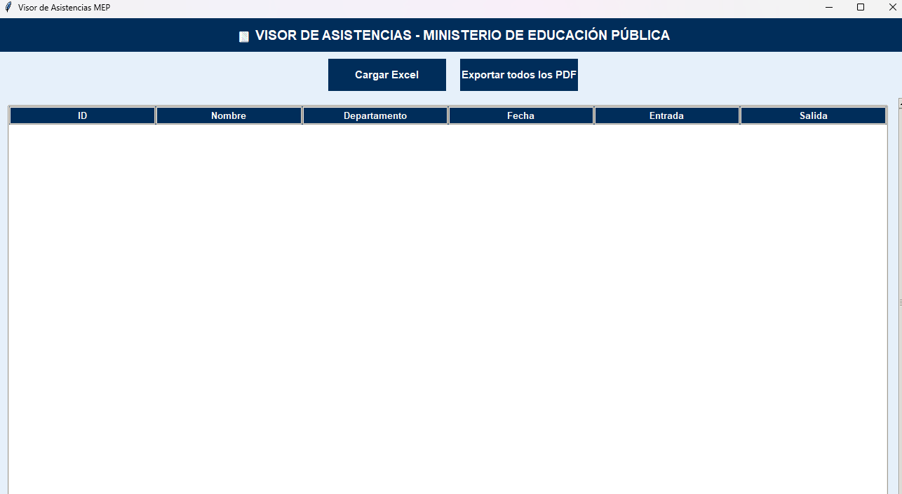

# Reloj Marcador - Generador de Reportes en PDF
Este proyecto automatiza la gestión de asistencia del personal docente.  
Obtiene los datos de un **reloj marcador** y genera automáticamente **reportes en PDF** para cada profesor, mostrando sus horarios de entrada y salida.

## Características
- Lectura de datos desde el reloj marcador.
- Procesamiento y organización de la información por profesor.
- Generación automática de archivos PDF.
- Reportes claros y listos para compartir o archivar.

## Tecnologías utilizadas
- Lenguaje: [Python]
- Librerías principales: [Pandas, Openpyxl, Pypdf, Pywin32, Fpdf]

## Base de datos / Formato de entrada
- Fuente principal: archivo Excel (.xlsx / .xls)
- Contenido: registros de entrada y salida del personal docente
- Procesamiento: el script lee el Excel, organiza la información por profesor y genera los reportes en PDF
  
## Ejemplo del programa
Un ejemplo de como se ve el programa  

## Ejemplo de salida (PDF) 
Cada profesor recibe un PDF con su registro de asistencia: 
